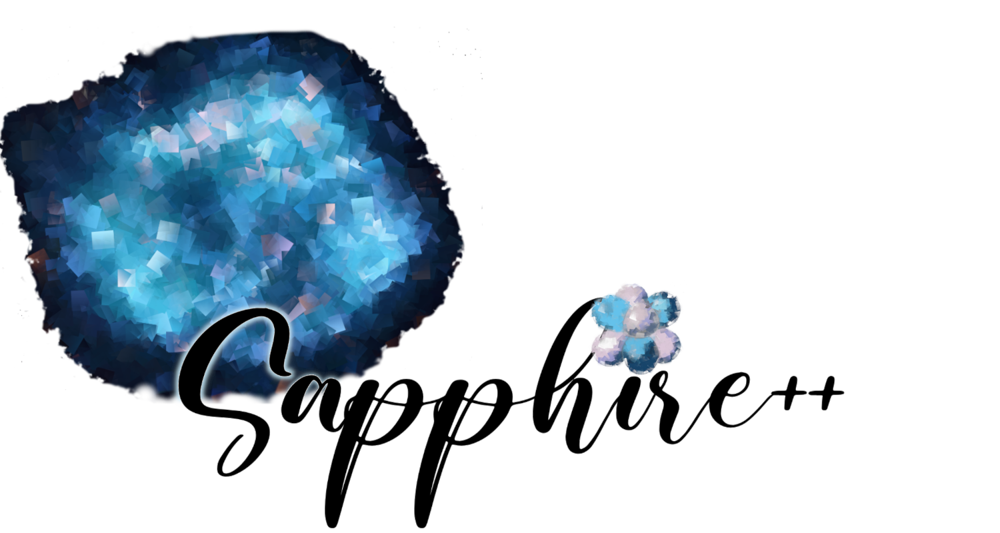

[](https://doi.org/10.5281/zenodo.14506755)
[](https://github.com/sapphirepp/sapphirepp/actions/workflows/tests.yml)
[](https://github.com/sapphirepp/sapphirepp/actions/workflows/clang-format-check.yml)
[](https://github.com/sapphirepp/sapphirepp/actions/workflows/documentation.yml)
[](https://github.com/sapphirepp/sapphirepp/actions/workflows/full-test-suite.yml)

<p align="center">

</p>

# About

Sapphire++ is an acronym and stands for \"<strong>S</strong>imulating
<strong>a</strong>strophysical <strong>p</strong>lasmas and
<strong>p</strong>articles with <strong>hi</strong>ghly
<strong>r</strong>elativistic <strong>e</strong>nergies in
C<strong>++</strong>\".

It is a code to simulate the interaction of charged particles with a background
plasma, a typical example is the propagation and acceleration of cosmic rays. To
this end it solves a Vlasov-Fokker-Planck (VFP) equation in mixed coordinates,
namely

$$
  \frac{\partial f}{\partial t} + (\mathbf{u} + \mathbf{v}) \cdot \nabla_{x} f -
  \gamma m \frac{\mathrm{D} \mathbf{u}}{\mathrm{D} t} \cdot \nabla_{p}f -
  \mathbf{p} \cdot\nabla_{x} \mathbf{u}\cdot \nabla_{p} f +
  q \mathbf{v} \cdot \left( \mathbf{B} \times \nabla_{p} f \right) =
  \frac{\nu}{2} \Delta_{\theta, \varphi} f + S .
$$

Sapphire++ is developed by the [Astrophysical Plasma
Theory](https://www.mpi-hd.mpg.de/mpi/en/research/scientific-divisions-and-groups/independent-research-groups/apt)
group located at the [Max-Planck-Institut für
Kernphysik](https://www.mpi-hd.mpg.de/mpi/en/) in Heidelberg, Germany.

## Installation

Sapphire++ builds on top of the [deal.II](https://www.dealii.org) finite element
library. To install [deal.II](https://www.dealii.org) and other prerequisites
for Sapphire++ we provide an [installation script](scripts/install-dealii.sh).
Run the script by executing:

```shell
chmod u+x install-dealii.sh
./install-dealii.sh
```

To download Sapphire++ itself, you can either get the latest release as a
tarball on the [release page](https://github.com/sapphirepp/sapphirepp/releases)
or clone the repository:

```shell
git clone https://github.com/sapphirepp/sapphirepp
```

Afterwards you can compile Sapphire++, with `cmake` and `make`:

```shell
cd sapphirepp
export DEAL_II_DIR="path/to/deal.II"
cmake -S . -B build -DCMAKE_BUILD_TYPE=Release -DEXAMPLES=ON
make --directory=build
```

A detailed description of the installation process can be found in the
[documentation](https://sapphirepp.org#installation).

## Getting started

To run Sapphire++ you need to provide a parameter file:
  
```shell
./build/sapphirepp parameter-template.prm
```

You enable parallel execution by using `mpirun`:

```shell
mpirun -np N ./build/sapphirepp parameter-template.prm
```

where `N` is the number of processors to use.

Comprehensive documentation is available on our website
[sapphire.org](https://sapphirepp.org). There, you can find a [quick-start
guide](https://sapphirepp.org/latest/quick-start.html) and various
[tutorials](https://sapphirepp.org/latest/examples.html). The source code for
the examples is located in the [examples](examples) folder.

If you have any questions,
feel free to reach out to us
via the [GitHub Discussions page](https://github.com/sapphirepp/sapphirepp/discussions)
for support and community interaction.

## Licence

Sapphire++ is distributed under the [LGPL 3.0 license](LICENSE).

If you use this software in your research, please cite the following paper:

> Schween, N. W. and Schulze, F. and Reville, B., Sapphire++: A Particle Transport Code Combining a Spherical Harmonic Expansion and the Discontinuous Galerkin Method, 2025, DOI: https://doi.org/10.1016/j.jcp.2024.113690

Here's the BibTeX entry for the paper:

```bibtex
@article{Sapphirepp2025,
title = {Sapphire++: A particle transport code combining a spherical harmonic expansion and the discontinuous Galerkin method},
journal = {Journal of Computational Physics},
volume = {523},
pages = {113690},
year = {2025},
issn = {0021-9991},
doi = {https://doi.org/10.1016/j.jcp.2024.113690},
url = {https://www.sciencedirect.com/science/article/pii/S0021999124009380},
author = {Nils W. Schween and Florian Schulze and Brian Reville},
keywords = {Numerical methods, Vlasov-Fokker-Planck, Cosmic rays, Discontinuous Galerkin method, Spherical harmonics, Particle acceleration},
abstract = {We present Sapphire++, an open-source code designed to numerically solve the Vlasov–Fokker–Planck equation for astrophysical applications. Sapphire++ employs a numerical algorithm based on a spherical harmonic expansion of the distribution function, expressing the Vlasov–Fokker–Planck equation as a system of partial differential equations governing the evolution of the expansion coefficients. The code utilises the discontinuous Galerkin method in conjunction with implicit and explicit time stepping methods to compute these coefficients, providing significant flexibility in its choice of spatial and temporal accuracy. We showcase the code's validity using examples. In particular, we simulate the acceleration of test particles at a parallel shock and compare the results to analytical predictions. The Sapphire++ code Image 1 is available as a free and open-source tool for the community.}
}
```

Sapphire++ builds on top of the [deal.II](https://www.dealii.org) library.
We therefore encourage you to [cite the deal.II library](https://www.dealii.org/community/publications/) as well:

> Pasquale Claudio Africa, Daniel Arndt, Wolfgang Bangerth, Bruno Blais, Marc Fehling, Rene Gassmöller, Timo Heister, Luca Heltai, Martin Kronbichler, Matthias Maier, Peter Munch, Magdalena Schreter-Fleischhacker, Jan Philipp Thiele, Bruno Turcksin, David Wells, Vladimir Yushutin  
> The deal.II Library, Version 9.6  
> Journal of Numerical Mathematics, vol. 32, pp. 369-380, 2024.  
> DOI: 10.1515/jnma-2024-0137; preprint; bibtex

```bibtex
@Article{2024:africa.arndt.ea:deal,
  author  = {Pasquale C. Africa and Daniel Arndt and Wolfgang Bangerth and Bruno Blais and
             Marc Fehling and Rene Gassm{\"o}ller and Timo Heister and Luca Heltai and
             Sebastian Kinnewig and Martin Kronbichler and Matthias Maier and Peter Munch and
             Magdalena Schreter-Fleischhacker and Jan P. Thiele and Bruno Turcksin and
             David Wells and Vladimir Yushutin},
  title   = {The deal.II library, Version 9.6},
  journal = {Journal of Numerical Mathematics},
  year    = 2024,
  volume  = 32,
  number  = 4,
  pages   = {369--380},
  doi     = {10.1515/jnma-2024-0137}
}
```

> D. Arndt, W. Bangerth, D. Davydov, T. Heister, L. Heltai, M. Kronbichler, M. Maier, J.-P. Pelteret, B. Turcksin, D. Wells  
> The deal.II finite element library: design, features, and insights  
> Computers & Mathematics with Applications, vol. 81, pages 407-422, 2021.  
> DOI: 10.1016/j.camwa.2020.02.022; preprint

```bibtex
@Article{dealii2019design,
  title   = {The {deal.II} finite element library: Design, features, and insights},
  author  = {Daniel Arndt and Wolfgang Bangerth and Denis Davydov and
             Timo Heister and Luca Heltai and Martin Kronbichler and
             Matthias Maier and Jean-Paul Pelteret and Bruno Turcksin and
             David Wells},
  journal = {Computers \& Mathematics with Applications},
  year    = {2021},
  DOI     = {10.1016/j.camwa.2020.02.022},
  pages   = {407-422},
  volume  = {81},
  issn    = {0898-1221},
  url     = {https://arxiv.org/abs/1910.13247}
}
```

## Contributing

We welcome contributions to Sapphire++. If you want to contribute code, please
follow the [contribution guidelines](CONTRIBUTING.md) and our
[code of conduct](CODE_OF_CONDUCT.md).
