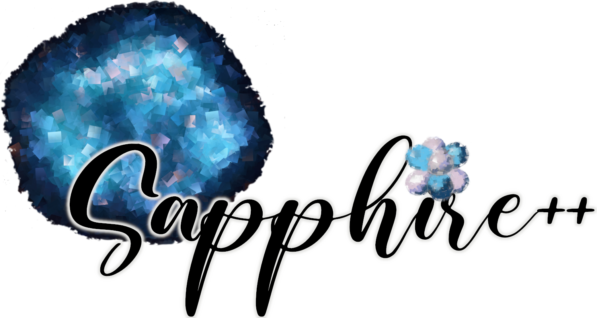

[](https://github.com/sapphirepp/sapphirepp/actions/workflows/tests.yml)
[](https://github.com/sapphirepp/sapphirepp/actions/workflows/clang-format-check.yml)
[](https://github.com/sapphirepp/sapphirepp/actions/workflows/full-test-suite.yml)

<p align="center">

</p>

# About

Sapphire++ is an acronym and stands for \"<strong>S</strong>imulating
<strong>a</strong>strophysical <strong>p</strong>lasmas and
<strong>p</strong>articles with <strong>hi</strong>ghly
<strong>r</strong>elativistic <strong>e</strong>nergies in
C<strong>++</strong>\".

It is a code to simulate the interaction of charged particles with a background
plasma, a typical example is the propagation and acceleration of cosmic rays. To
this end it solves a Vlasov-Fokker-Planck (VFP) equation in mixed coordinates,
namely

$$
  \frac{\partial f}{\partial t} + (\mathbf{u} + \mathbf{v}) \cdot \nabla_{x} f -
  \gamma m \frac{\mathrm{D} \mathbf{u}}{\mathrm{D} t} \cdot \nabla_{p}f -
  \mathbf{p} \cdot\nabla_{x} \mathbf{u}\cdot \nabla_{p} f +
  q \mathbf{v} \cdot \left( \mathbf{B} \times \nabla_{p} f \right) =
  \frac{\nu}{2} \Delta_{\theta, \varphi} f + S .
$$

Sapphire++ is developed by the [Astrophysical Plasma
Theory](https://www.mpi-hd.mpg.de/mpi/en/research/scientific-divisions-and-groups/independent-research-groups/apt)
group located at the [Max-Planck-Institut für
Kernphysik](https://www.mpi-hd.mpg.de/mpi/en/) in Heidelberg, Germany.

## Installation

Sapphire++ builds on top of the [deal.II](https://www.dealii.org) finite element
library. To install [deal.II](https://www.dealii.org) and other prerequisites
for Sapphire++ we provide an [installation script](scripts/install-dealii.sh).
Run the script by executing:

```shell
chmod u+x install-dealii.sh
./install-dealii.sh
```

To download Sapphire++ itself, you can either get the latest release as a
tarball on the [release page](https://github.com/sapphirepp/sapphirepp/releases)
or clone the repository:

```shell
git clone https://github.com/sapphirepp/sapphirepp
```

Afterwards you can compile Sapphire++, with `cmake` and `make`:

```shell
cd sapphirepp
export DEAL_II_DIR="path/to/deal.II"
cmake -S . -B build -DCMAKE_BUILD_TYPE=Release -DEXAMPLES=ON
cd build && make
```

A detailed description of the installation process can be found in the
[documentation](https://sapphirepp.org#installation).

## Getting started

To run Sapphire++ you need to provide a configuration file:
  
```shell
./sapphirepp parameter.prm
```

You enable parallel execution by using `mpirun`:

```shell
mpirun -np N ./sapphirepp parameter.prm
```

where `N` is the number of processors to use.

Comprehensive documentation is available on our website
[sapphire.org](https://sapphirepp.org). There, you can find a [quick-start
guide](https://sapphirepp.org/latest/quick-start.html) and various
[tutorials](https://sapphirepp.org/latest/examples.html). The source code for
the examples is located in the [examples](examples) folder.

## Licence

Sapphire++ is distributed under the [LGPL 3.0 license](LICENSE).

If you use this software in your research, please cite the following paper:

>  Schween, N. W. and Schulze, F. and Reville, B., Sapphire++: A  Particle Transport Code Combining a Spherical Harmonic Expansion and the Discontinuous Galerkin Method, 2024, DOI: http://dx.doi.org/10.2139/ssrn.4808843

Here's the BibTeX entry for the paper:

```bibtex
@Article{Sapphirepp2024,
	note = {Preprint},
	pubstate = {submitted},
	date = {2024},
	doi = {10.2139/ssrn.4808843},
	title = {Sapphire++: A Particle Transport Code Combining a Spherical Harmonic Expansion and the Discontinuous {Galerkin} Method},
	author = {Schween, Nils Walter and Schulze, Florian and Reville, Brian}
}
```

## Contributing

We welcome contributions to Sapphire++. If you want to contribute code, please
follow the [contribution guidelines](CONTRIBUTING.md) and our
[code of conduct](CODE_OF_CONDUCT.md).
